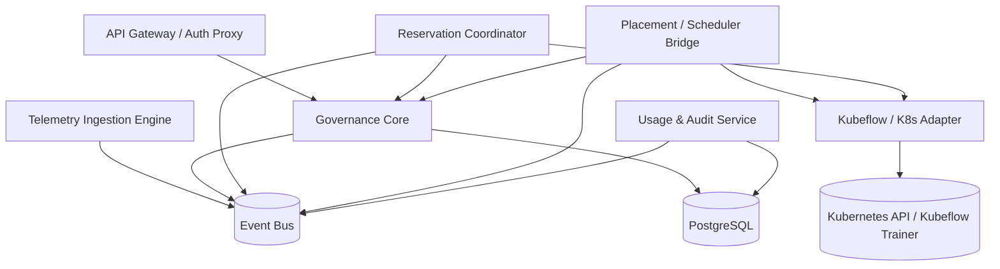
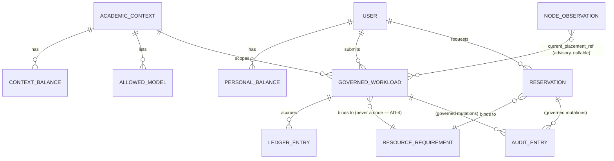

# Architecture Spine — University AI Compute Management Platform

This spine fixes the invariants that keep independently built units from diverging. It is
the structural **HOW** for `SPEC.md`; it adds no capabilities and relaxes no constraint.
Rationale for each decision lives in `.memlog.md`, not here. Technology versions were
web-verified current at authoring (August 2026).

## Design Paradigm

**Layered Control Plane with a Hexagonal governance core and a separate event-driven
telemetry plane.**

- **Control plane, not a job runner.** Reservations, quota balances, and admitted
  workloads are *desired state*; controllers reconcile the observed cluster toward it.
  This is the Kubernetes operator model and it buys self-healing after a restart or a
  missed event for free.
- **Hexagonal core (ports & adapters).** The governance domain — admission decision, quota
  math, role/context scoping, placement constraints, the equivalent-or-better predicate —
  is pure and depends on nothing infrastructural. Kubernetes, Kubeflow Trainer, the
  LLM-serving layer, and the identity provider are reached only through ports.
- **Event-driven telemetry plane.** High-volume node health and metering signals never
  touch the synchronous governance path; they flow over an event bus into a dedicated
  ingestion engine that emits domain events (e.g. `node.failing`) back to the controllers.

Layer → namespace map (Go module):

```text
domain/        # pure: entities, invariants, the equivalent-or-better resolver. No infra imports.
app/           # application services / use-cases orchestrating the domain (one per CAP cluster)
adapters/      # driven adapters: k8s, kubeflow-trainer, serving-layer, oidc, postgres, nats
controllers/   # controller-runtime reconcilers for the Reservation and GovernedWorkload CRDs
transport/     # driving adapters: gRPC services, edge REST gateway
cmd/           # binaries: apiserver, reservation-controller, placement-bridge, telemetry-ingest
```

## System Boundaries & Dependencies

| # | Component | Owns | Talks to (protocol) |
|---|---|---|---|
| 1 | **API Gateway / Auth Proxy** | Edge termination, authN via upstream OIDC, resolution of role tier + academic-context membership, rate limiting. **No domain state.** | Clients (REST/JSON); Governance Core (gRPC); OIDC provider (OIDC/HTTPS) |
| 2 | **Governance Core** | The hexagonal domain: CAP-1 admission, CAP-2 quota & metering ledger, CAP-3 role/context scoping, CAP-4 placement constraints, CAP-7 equivalent-or-better resolver. **Single writer of governance state.** | Postgres (SQL, serializable); Reservation Coordinator & Placement Bridge (gRPC); event bus (publish domain events via outbox) |
| 3 | **Reservation Coordinator** | CAP-5 reservation admission & collision resolution, CAP-6 window-enforcement scheduling. Reconciles the `Reservation` CRD. | Governance Core (gRPC, calls CAP-7); Placement Bridge (event bus: `reservation.window.opening`); K8s API (watch) |
| 4 | **Placement / Scheduler Bridge** | CAP-8 training lifecycle, CAP-10 node-failure relocation, CAP-6 preemption-avoidance fallback. Runs the shared `relocateOrElse` procedure (AD-8). Reconciles the `GovernedWorkload` CRD. | K8s/Kubeflow Adapter (in-process port); Governance Core (gRPC, calls CAP-7); event bus (consumes `node.failing`, `reservation.window.opening`) |
| 5 | **Kubeflow / K8s Adapter** | The **only** component that calls the cluster API, GPU device plugins, or Kubeflow Trainer. Emits pod specs and `TrainJob` resources; observes node conditions and job status. | Kubernetes API (client-go / informers); NVIDIA device plugin (resource requests); Kubeflow Trainer v2 (`TrainJob` CRD) |
| 6 | **Telemetry Ingestion Engine** | CAP-9 node health-state computation from GPU/DCGM metrics + serving-layer counters; emits `node.failing`, `node.recovered`. Async only. | Event bus (consume raw signals, publish health events); metrics TSDB (write); Governance Core reads health snapshots via gRPC |
| 7 | **Usage & Audit Service** | CAP-11 reconciled-ledger reads, CAP-12 append-only audit log. | Postgres (read ledger; append-only audit table); event bus (consume outbox stream) |
| 8 | **Event Bus** | Durable transport for telemetry signals, domain events, and the transactional-outbox relay. | All planes |

Full C4 context and container view: `companion-files/diagrams/system-context.mmd`.

## Invariants & Rules

Dependency direction (an arrow means *may depend on*; nothing points back):



The domain (`Governance Core`) depends on nothing to its right. Adapters never call back
into controllers; controllers never bypass the Core to touch Postgres.

Each AD carries the spine fields (**Binds / Prevents / Rule**) and the ADR fields the
handoff needs (**Status / Consequences / Rejected**). `[ASSUMPTION]` marks a fast-path
call the director should confirm.

### AD-1 — Layered control plane with a hexagonal governance core

- **Context:** the platform is equal parts stateful governance logic (quota math,
  collision rules) and infrastructure glue (Kubernetes, Kubeflow, serving layer). Mixing
  them makes the rules untestable and couples policy to a cluster.
- **Binds:** all capabilities.
- **Prevents:** infrastructure SDKs leaking into quota and reservation logic; the domain
  becoming impossible to test without a live cluster.
- **Rule:** code under `domain/` imports zero infrastructure packages. Every external
  system is reached through a port defined in `domain/` and implemented in `adapters/`.
  Domain functions perform no I/O.
- **Status:** Accepted.
- **Consequences:** *gained* — the governance rules are unit-testable in isolation and the
  cluster stack can change without touching policy; *sacrificed* — an upfront port/adapter
  layer and mapping boilerplate the team must maintain.
- **Rejected:** a service-per-capability event-driven microservice mesh — real
  distribution cost and eventual-consistency hazards for a single < 40-node fleet, with no
  scaling need that justifies it; a single-tier CRUD service — the quota/reservation
  invariants would end up scattered across handlers.

### AD-2 — Desired-state reconciliation, not imperative scheduling

- **Context:** reservations, admitted workloads, and placements outlive any single request
  and must survive a control-plane restart or a dropped event.
- **Binds:** CAP-5, CAP-6, CAP-8, CAP-10.
- **Prevents:** one-shot scheduling actions that cannot recover after a restart, a lost
  event, or a partial failure.
- **Rule:** the Reservation Coordinator and Placement Bridge are **level-triggered** and
  **idempotent** — each reconcile recomputes the target from stored desired state plus the
  observed cluster, and converges. No action assumes a prior action succeeded.
- **Status:** Accepted.
- **Consequences:** *gained* — self-healing and crash-tolerance for free, and the same
  code path handles first run and recovery; *sacrificed* — every operation must be written
  idempotently and reconcile loops cost steady-state CPU even when nothing changes.
- **Rejected:** an imperative job queue with a saga/compensation layer — more moving parts
  and bespoke recovery code to get a weaker version of what reconciliation gives natively.

### AD-3 — The governance store is the single source of truth

- **Context:** two candidate sources of truth exist — the Postgres governance state and
  the live cluster. If both are authoritative they will disagree.
- **Binds:** all persisted state.
- **Prevents:** components disagreeing on quota or reservation truth; decisions made from
  a stale cluster read.
- **Rule:** every governance decision reads the Postgres transactional store. Cluster
  state (pods, `TrainJob`s, node conditions) is an *observation*, never authoritative. The
  Governance Core is the only writer of governance tables.
- **Status:** Accepted.
- **Consequences:** *gained* — one place to reason about correctness, transactional
  invariants (AD-5, AD-6) are possible; *sacrificed* — the store must be kept reconciled
  with reality, and it is a availability-critical dependency (mitigated by AD-2 recovery
  and SPEC A-11 isolated infrastructure).
- **Rejected:** Kubernetes (etcd/CRDs) as the sole source of truth — no multi-row
  serializable transactions, so the quota and non-overlap invariants become racy.

### AD-4 — A workload binds to a requirement, never to a node  `[ADOPTED — SPEC C-13]`

- **Context:** SPEC C-13 states a workload binds to a resource requirement; node identity
  is only where that requirement is currently met and changes under relocation.
- **Binds:** CAP-4, CAP-5, CAP-6, CAP-7, CAP-10.
- **Prevents:** a durable workload→node foreign key that breaks the moment relocation or
  preemption-avoidance moves the workload.
- **Rule:** no schema makes a node id a required key or foreign key of a workload or
  reservation. `current_placement_ref` is nullable, advisory, holds only the last-observed
  node, is updated outside any domain transaction, and is never read to make a governance
  decision.
- **Status:** Accepted (adopted from SPEC — not re-litigated here).
- **Consequences:** *gained* — relocation and preemption-avoidance are pure placement
  changes with no identity churn; *sacrificed* — "where is workload X right now" is an
  observation that can lag, so operator tooling must treat placement as eventually
  consistent.
- **Rejected:** a durable `workload.node_id` FK — see SPEC C-13; it would make CAP-10 and
  CAP-6 relocation a destroy-and-recreate.

### AD-5 — Atomic multi-balance quota transactions with a fixed lock order

- **Context:** CAP-2 debits two balances (personal and academic-context) per admission,
  under concurrency, and must never let either go negative.
- **Binds:** CAP-2.
- **Prevents:** concurrent admissions double-spending a balance; deadlock between the two
  balance locks.
- **Rule:** `reserve` and `reconcile` are the only writers of a balance. Both balances are
  updated in one `SERIALIZABLE` transaction with rows locked in ascending-id order. A
  negative balance is rejected by a `CHECK` constraint, so an over-reservation fails
  before execution rather than being truncated to fit.
- **Status:** Accepted.
- **Consequences:** *gained* — the "no negative balance" and "no double-spend" invariants
  are enforced by the database, not hopeful application code; *sacrificed* — serialization
  failures must be retried, and admission throughput on a single hot context is bounded by
  transaction rate (acceptable under SPEC A-2 moderate load).
- **Rejected:** optimistic version columns checked in app code — correct only if every
  writer remembers to check; a distributed lock in the event bus / a cache — adds an
  external dependency to the critical path and a new failure mode.

### AD-6 — Reservation capacity is enforced by the datastore, per interchangeable unit

- **Context:** instructors request a *hardware class* for a window. The 2× 48 GB class has
  one node; the 24 GB class (SPEC C-1) has **many interchangeable** nodes. A per-class
  non-overlap rule is wrong for the 24 GB class — two non-conflicting 24 GB reservations in
  overlapping windows must both be grantable, up to the number of units that exist.
- **Binds:** CAP-5.
- **Prevents:** granting more overlapping reservations for a class than it has
  interchangeable units — and, conversely, wrongly rejecting a reservation a spare unit
  could satisfy.
- **Rule:** each hardware class carries a fixed `unit_count` = the number of
  interchangeable allocatable units in it. A granted reservation holds one **abstract
  capacity slot** `(class_id, slot_no ∈ 1..unit_count)` for its window. Non-overlap is a
  PostgreSQL `EXCLUDE USING gist (class_id WITH =, slot_no WITH =, during WITH &&)`
  constraint, so at most `unit_count` reservations for a class may overlap in time. Grant
  assigns the lowest free `slot_no` deterministically; if no slot is free the request
  falls through to CAP-7 or `PENDING_ADMIN_REVIEW`. `slot_no` is an abstract capacity
  index, **not** a physical node — the physical node is still chosen at window start by
  placement (AD-7), preserving AD-4 / SPEC C-13.
- **Status:** Accepted.
- **Consequences:** *gained* — the capacity invariant holds for both a singleton class and
  a large interchangeable pool, regardless of how many coordinator replicas run;
  *sacrificed* — `unit_count` per class is now state that must track real fleet inventory
  changes (add/retire a node), and the rule is expressed in Postgres-specific features so a
  database swap is a real migration (accepted — AD-3 already commits to Postgres).
- **Rejected:** per-class pairwise non-overlap (`EXCLUDE (class_id WITH =, during WITH &&)`)
  — the bug this AD fixes: it treats a 20-node pool as one slot; binding each reservation
  to a specific physical node at grant time — violates AD-4 / C-13 and loses the freedom to
  place on any equivalent node at window start; an in-process interval tree — breaks the
  instant a second replica exists; advisory locks only — pushes the rule back into
  application code a new call site can forget.

### AD-7 — The equivalent-or-better resolver is one pure deterministic function

- **Context:** three capabilities (CAP-5, CAP-6, CAP-10) need "find an equivalent-or-better
  node". Three implementations would drift.
- **Binds:** CAP-7 and its callers CAP-5, CAP-6, CAP-10.
- **Prevents:** three call sites growing three subtly different definitions of
  "equivalent-or-better".
- **Rule:** one function `resolve(requirement, span, fleetSnapshot) -> Node |
  NO_QUALIFYING_NODE` in `domain/`. No I/O; it reads a point-in-time fleet snapshot passed
  by the caller. Tie-break is fixed: minimise per-GPU VRAM, then GPU count, then node id
  ascending.
- **Status:** Accepted.
- **Consequences:** *gained* — identical selection everywhere, trivially testable, and
  reproducible for audit; *sacrificed* — callers must assemble a consistent fleet snapshot
  first, and a stale snapshot can yield a node that is no longer free (handled by the
  caller re-checking on placement).
- **Rejected:** a resolver service called over RPC — network failure on a hot path for
  logic that is pure computation; per-caller inline logic — the drift this AD exists to
  prevent.

### AD-8 — Relocate-first, preempt-fallback is one shared procedure

- **Context:** CAP-6 (window start) and CAP-10 (node failure) both must move running
  non-owning workloads off hardware, and SPEC now requires relocation attempted before
  preemption.
- **Binds:** CAP-6, CAP-10.
- **Prevents:** window-enforcement and node-failure handling diverging on how they move a
  running workload.
- **Rule:** both call `relocateOrElse(workload, fallback)`. On a CAP-7 hit the workload
  moves and keeps its lifecycle state and queue standing — no state transition. On
  `NO_QUALIFYING_NODE` the caller's fallback runs: **front-of-queue re-entry** for CAP-10;
  **termination signal → grace period → forced termination → terminal `PREEMPTED`** for
  CAP-6. `PREEMPTED` is reachable only through this fallback.
- **Status:** Accepted.
- **Consequences:** *gained* — one tested procedure, so the two triggers cannot diverge and
  the "relocated ≠ preempted" guarantee holds uniformly; *sacrificed* — the shared
  procedure must be parameterised carefully, and a burst of relocations competes for the
  same scarce spare capacity (feeds SPEC A-12 / OQ-6).
- **Rejected:** separate relocation logic per trigger — the exact divergence Workshop-2
  flagged on the original bundled reservation action.

### AD-9 — Synchronous governance plane separated from asynchronous telemetry plane

- **Context:** node health and metering signals are high-volume and lossy; admission
  decisions are low-volume and must be fast and reliable.
- **Binds:** CAP-9, CAP-10, CAP-11 (telemetry) vs CAP-1..CAP-8, CAP-12 (governance).
- **Prevents:** metric-ingestion volume degrading admission latency; telemetry loss
  blocking a governance decision.
- **Rule:** raw telemetry flows only over the event bus into the Telemetry Ingestion
  Engine. The governance API never blocks on telemetry. `node.failing` reaches the
  Placement Bridge as an event, which then invokes AD-8. CAP-2 reconciliation rides this
  same plane (AD-13).
- **Status:** Accepted.
- **Consequences:** *gained* — admission latency is isolated from metrics load, and a
  telemetry outage degrades only freshness (CAP-9), not governance; *sacrificed* — node
  health is eventually consistent, so CAP-10 reacts on an event delay rather than
  instantly, and there are now two runtime planes to operate.
- **Rejected:** the governance API scraping metrics inline — couples admission latency to
  the metrics pipeline and makes a metrics outage a governance outage.

### AD-10 — Audit entries written in the same transaction as the mutation

- **Context:** SPEC C-8 makes the audit trail a mandate; a mutation that commits without
  its audit row (or vice versa) breaks it.
- **Binds:** CAP-12, SPEC C-8.
- **Prevents:** a governed mutation committing without its audit record, or an audit
  record without its mutation, after a crash.
- **Rule:** every governed mutation writes `{actor, action, target, timestamp}` to the
  append-only audit table **and** an outbox row **in the same transaction** as the
  mutation. A relay publishes the outbox to the event bus at-least-once. The audit table
  grants no `UPDATE` or `DELETE`.
- **Status:** Accepted.
- **Consequences:** *gained* — audit completeness is a transactional guarantee, not a
  convention; *sacrificed* — every governed write path carries the audit + outbox write,
  and downstream consumers must dedupe the at-least-once stream.
- **Rejected:** emitting audit events straight to the bus from application code — a crash
  between commit and publish loses the entry; a periodic diff job — cannot reconstruct
  actor/intent after the fact.

### AD-11 — Desired state is modelled as CRDs  `[ASSUMPTION]`

- **Context:** the coordinator/bridge desired state (`Reservation`, `GovernedWorkload`)
  could live in Postgres only, or as Kubernetes Custom Resources.
- **Binds:** CAP-5, CAP-6, CAP-8, CAP-10.
- **Prevents:** bespoke scheduler state that standard Kubernetes tooling cannot observe or
  debug.
- **Rule:** `Reservation` and `GovernedWorkload` are Custom Resources in group
  `compute.university.edu/v1alpha1`, reconciled by controller-runtime controllers. The
  `GovernedWorkload` controller creates and owns the Kubeflow `TrainJob` for distributed
  jobs.
- **Status:** Accepted `[ASSUMPTION]` — confirm with the director.
- **Consequences:** *gained* — `kubectl`-level observability and events, and controller
  scaffolding from kubebuilder; *sacrificed* — desired state now lives in two stores
  (Postgres for governance truth, etcd for reconciliation state) that must be kept
  aligned, plus CRD versioning overhead.
- **Rejected:** desired state only in Postgres with Kubernetes as a dumb actuator — loses
  the observability and forces a hand-rolled watch/reconcile loop.

### AD-12 — Distributed training binds to Kubeflow Trainer v2 `TrainJob`

- **Context:** as of 2026 the framework-specific v1 Training Operator CRDs
  (`PyTorchJob` / `TFJob` / `MPIJob`) are superseded by Kubeflow Trainer v2's single
  `TrainJob` CRD; v1 is maintained only on its `release-1.9` branch. SPEC C-3 still names
  the v1 operator.
- **Binds:** CAP-8, SPEC C-3.
- **Prevents:** building CAP-8 on a deprecated, end-of-life-track API.
- **Rule:** the Kubeflow adapter emits the single `TrainJob` CRD of Kubeflow Trainer v2;
  it does not use `PyTorchJob` / `TFJob` / `MPIJob`.
- **Status:** Accepted. **Upstream action (done):** SPEC C-3 and A-4 were updated in
  Spec-2 from "Kubeflow Training Operator's job types" to "Kubeflow Trainer v2 `TrainJob`";
  C-3 carries a Spec-2-update note pointing back to this AD.
- **Consequences:** *gained* — one CRD and one SDK across PyTorch/JAX/DeepSpeed/etc., and
  an actively maintained dependency; *sacrificed* — Trainer v2 is a younger API surface, so
  some edge behaviours are less battle-tested than v1's.
- **Rejected:** Training Operator v1 — on an EOL track; Volcano or a hand-rolled
  gang-scheduler — reimplements what Trainer v2 already provides for distributed jobs.

### AD-13 — Quota admission is serving-layer-free; reconciliation is asynchronous

- **Context:** CAP-2 admission is on the synchronous governance path (AD-9 forbids it
  blocking on telemetry), but CAP-2 *reconciliation* needs actual prompt/completion token
  counts from the LLM-serving layer (SPEC C-9) — which is telemetry-plane data.
- **Binds:** CAP-2, and the AD-9 plane boundary.
- **Prevents:** admission latency being coupled to the serving layer; a builder wiring a
  synchronous serving-layer call into the admission path.
- **Rule:** three distinct steps, only the first synchronous.
  1. **Admission (sync):** the Governance Core reserves the estimated cap by reading and
     writing only the stored balances (AD-5). It never contacts the serving layer.
  2. **Enforcement (in the serving-layer adapter):** the adapter is handed the reserved
     cap at start and truncates generation locally when the cap is hit — no call back to
     governance mid-stream.
  3. **Reconciliation (async):** on completion the serving layer emits a
     `workload.tokens.finalized` event carrying the actual counts; the metering consumer
     normalises it and the Governance Core runs the `reconcile` transaction (AD-5) off
     that event. There is no dedicated synchronous serving-layer path.
- **Status:** Accepted.
- **Consequences:** *gained* — admission stays fast and serving-layer-independent; balances
  are eventually exact; *sacrificed* — a balance is briefly optimistic (reserved-estimate,
  not reconciled-actual) between completion and the reconcile event, and a lost
  `workload.tokens.finalized` event must be repaired by a periodic sweep against the
  serving layer's own ledger.
- **Consequence — back-to-back transient over-consumption:** within that optimistic window,
  a second workload from the same student or context is admitted against a not-yet-reconciled
  balance, so two consecutive workloads can transiently over-consume against a budget even
  though AD-5's non-negativity guarantee still holds for every individual transaction. This
  is **accepted as-is**: it is bounded by one workload's estimate-vs-actual gap, self-corrects
  at the next reconcile, and sits within SPEC A-2's moderate-load assumption. No mitigation
  (e.g. a per-actor in-flight-workload cap) is added at this stage; revisit only if A-2 is
  lifted or reconcile latency proves large.
- **Rejected:** synchronous reconcile at completion — puts the serving layer on a blocking
  governance path; no reconciliation (charge the estimate) — SPEC CAP-2 requires
  `actual ≤ cap` settlement and unused-reservation release.

## Consistency Conventions

| Concern | Convention |
|---|---|
| Entity ids | Opaque strings, no internal structure assumed (per Spec-1). Generated as UUIDv7. |
| Timestamps | RFC 3339, UTC, second precision (SPEC C-11 forbids sub-second dependence). |
| CAP-1 response envelope | `{ outcome, named_reason?, quota_snapshot: { personal_remaining, context_remaining }, queue_position?, estimated_start?, estimate_basis? }` |
| Rejection reasons | Closed enum exactly as SPEC CAP-1; no free-text reasons. |
| Domain events | `<entity>.<past-tense-verb>` — `reservation.granted`, `reservation.window.opening`, `workload.admitted`, `workload.preempted`, `workload.relocated`, `workload.tokens.finalized`, `node.failing`, `quota.reconciled`, `audit.recorded`. |
| CRD group / version | `compute.university.edu/v1alpha1`. |
| Internal RPC | gRPC with protobuf; one service per component; errors as `google.rpc.Status`. |
| Edge API | REST/JSON through the API Gateway only; never exposed by internal services. |
| Module layout | Hexagonal: `domain/ app/ adapters/ controllers/ transport/ cmd/` (see Design Paradigm). |
| Reconcile semantics | Level-triggered, idempotent, converge-to-target (AD-2). |

## Stack

Seed — verified current August 2026; the code owns this once it exists. The *why* is in `.memlog.md`.

| Name | Version | Note |
|---|---|---|
| Go | 1.24+ | Paved path for Kubernetes control planes. |
| sigs.k8s.io/controller-runtime | tracks target k8s minor | Kubebuilder scaffolding for the two CRD controllers. |
| Kubernetes | 1.37 target (≥ 1.36 supported) | GPUs via device plugins (SPEC C-2). |
| NVIDIA GPU Operator / k8s-device-plugin | 24.9 | Whole-GPU strategy; MIG / time-slicing **not** used in iteration 1 (SPEC A-8). |
| Kubeflow Trainer | v2 (2.2) | Single `TrainJob` CRD (AD-12). |
| PostgreSQL | 17 | `SERIALIZABLE` transactions, `CHECK` (AD-5), `EXCLUDE USING gist` (AD-6). |
| NATS + JetStream | 2.11 | `[ASSUMPTION]` — event bus; lighter than Kafka for a < 40-node on-prem fleet. |
| Prometheus + DCGM exporter | current | Metric source for CAP-9; long-term TSDB choice **deferred**. |
| gRPC / protobuf | current | Internal transport. |
| OIDC provider | external | Consumed via adapter only (SPEC NG-9). |

## Capability → Architecture Map

| Capability | Lives in | Governed by |
|---|---|---|
| CAP-1 Admission & rejection taxonomy | Governance Core (`app/admission`) | AD-1, AD-3, conventions (envelope) |
| CAP-2 Quota & token metering | Governance Core (`app/quota`, `domain/ledger`) | AD-3, AD-5, AD-13 |
| CAP-3 Role / academic-context scoping | Governance Core (`domain/access`) + API Gateway | AD-1, SPEC C-7 |
| CAP-4 Heterogeneous placement | Governance Core (`domain/placement`) | AD-4, AD-7 |
| CAP-5 Reservation admission | Reservation Coordinator | AD-2, AD-6, AD-7 |
| CAP-6 Window enforcement (relocate → preempt) | Reservation Coordinator + Placement Bridge | AD-2, AD-8 |
| CAP-7 Equivalent-or-better resolution | Governance Core (`domain/resolve`) | AD-7 |
| CAP-8 Distributed training lifecycle | Placement Bridge + Kubeflow Adapter | AD-2, AD-11, AD-12 |
| CAP-9 Node health & status | Telemetry Ingestion Engine | AD-9 |
| CAP-10 Node-failure relocation | Placement Bridge | AD-8, AD-9, AD-4 |
| CAP-11 Usage reporting | Usage & Audit Service | AD-3, AD-10 |
| CAP-12 Audit trail | Usage & Audit Service | AD-10, SPEC C-8 |

## Structural Seed

Core entities (names + relationships only; an attribute that is itself an invariant is an AD, not a field here):



Workload & reservation state machine: `companion-files/diagrams/state-transitions.mmd`.

Binaries (`cmd/`): `apiserver` · `reservation-controller` · `placement-bridge` · `telemetry-ingest` · `usage-audit`. Each is a separate deployable; all share `domain/` and `adapters/`.

### Deployment & Environments

The dimension is owned by an external infrastructure team (SPEC NG-3, A-11); the spine
fixes only the placement invariant, not the provisioning.

- **Two failure domains, by rule.** The **control plane** (the five binaries, PostgreSQL,
  the event bus, the metrics store) runs on the isolated server infrastructure of SPEC
  A-11. The **assignable fleet** is the student-lab GPU machines of SPEC C-12, which join
  the Kubernetes cluster as worker nodes only. No control-plane component may be schedulable
  onto a lab node — enforced with a node taint / control-plane node selector.
- **Node loss is normal.** A lab worker vanishing is a routine `node.failing` event
  (AD-9 → AD-8), never an incident. Losing the control-plane host is the real outage and
  is the external team's HA problem (Deferred).
- **Environments:** at least `dev` and `prod` cluster contexts; the platform is
  environment-agnostic (all environment specifics are config, per Consistency
  Conventions). Exact count, sizing, and promotion flow are the infra team's.

## Deferred

| Item | Why it can wait |
|---|---|
| Queue-ordering / scheduling heuristic beyond CAP-1 position semantics and CAP-7 tie-break | SPEC NG-8 — the spine fixes the interfaces and the predicate; any further optimisation is a later, isolated decision. |
| Control-plane HA topology, replica count, leader election | `[ASSUMPTION]` deferrable — SPEC A-11 places control-plane infrastructure under an external ops team; decide with them. |
| Long-term metrics TSDB (plain Prometheus vs VictoriaMetrics vs Mimir) | Not load-bearing for any capability; CAP-9 only needs a recent-window read. |
| Event bus final choice if NATS/JetStream proves insufficient | `[ASSUMPTION]` tagged in Stack; swap is contained to `adapters/nats`. |
| Concrete values for every SPEC `[ILLUSTRATIVE DEFAULT]` (grace period, staleness, quota margin) | SPEC OQ-5 — policy owner not yet assigned. |
| Fairness bound for CAP-10 front-of-queue relocation under frequent node failure | SPEC OQ-6 / A-12 — needs a policy decision, not a structural one. |
| Per-course quota-policy engine | SPEC OQ-1 resolved: single institution-wide policy for iteration 1. |
| Backup / DR, secrets management, network policy, cluster ingress | Operational envelope owned by the external infrastructure team (SPEC NG-3, A-11); named here so it is not silently dropped. |
| Full API surface and payload schemas | Story-level detail; the response *envelope* and error taxonomy are fixed in Conventions. |
| Full-cohort concurrent-surge handling | SPEC OQ-2 / A-2 — explicitly out of scope for this iteration. |
